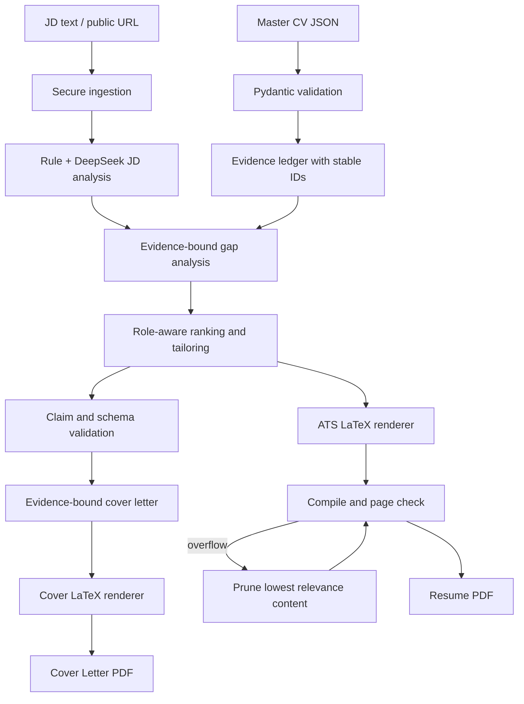

# System Architecture

## End-to-end flow



## Components

- `ingestion.py`: accepts inline JD text or a public HTTP(S) URL. It rejects credentials, private/loopback DNS results, unsupported content types, excessive redirects, and responses over 2 MiB.
- `models.py`: owns strict Pydantic contracts for Master CV, evidence, Gap Analysis, generated resume content, tailored resume, and Cover Letter.
- `analysis.py`: classifies role archetypes, extracts known ATS terms, builds stable evidence records, maps requirements to evidence, and computes relevance scores.
- `llm.py`: calls an OpenAI-compatible DeepSeek endpoint, supplies the response JSON schema, retries transport failures, and performs one schema-repair turn.
- `tailoring.py`: validates source data, constrains model output to source item IDs, hydrates immutable metadata from Master CV, rejects unknown evidence/skills/numbers, and provides deterministic fallback behavior.
- `latex.py`: escapes model/user values, renders single-column A4 article templates, invokes an allow-listed local compiler, checks page count, and records low-priority pruning only after three bounded spacing attempts. Compact rendering never silently drops a bullet.
- `server.py`: exposes granular MCP tools and the one-call `generate_application_package` orchestration tool.
- `cli.py`: provides the same orchestration as a local command and writes a complete JSON audit report.
- `application.py`: owns use cases and dependency injection. MCP and CLI are adapters over this service, not business-logic owners.
- `artifacts.py`: creates a unique UTC run ID and isolated output directory for each application package, preventing repeated submissions from overwriting prior PDFs.
- `docx_engine.py`: inspects OOXML styles, paragraph/table paths, page geometry, image relationships and anchors; performs bounded paragraph-level in-place replacement by copying every untouched DOCX ZIP entry.
- `tools.py`: centralizes compiler discovery and secret-free environment diagnostics used by MCP and future CLI/HTTP adapters.
- `ats.py`: produces transparent exact/semantic keyword coverage and missing-term diagnostics; it does not predict proprietary ATS rankings.
- `facts.py`: exposes verified micro-facts keyed by Evidence IDs, with source text, recognized technologies, and source-present metrics. Its metric extraction is also reused by Few-Shot validation and output quality checks to keep numeric-claim handling consistent.
- `critic/`: deterministic Resume/Cover Letter text and DOCX artifact critics that return structured diagnostics without inventing repairs.
- `docx_sanitizer.py`: shared lexical and OOXML sanitization; removes body tabs and style leader attributes while retaining ordinary alignment tabs.
- `harness/`: offline application-report assertions and Markdown scorecard generation for real PDF page/text, metric, forbidden-term, Critic, integrity, and optional ATS checks. Missing page or integrity evidence fails evaluation; JSON case manifests support per-case thresholds.

Ingestion decodes HTML using the declared HTTP charset, an HTML meta charset, and bounded UTF-8/GB18030/Big5 fallbacks. `DeepSeekClient` keeps repair context bounded to the original request plus the latest failed output and retries empty/runtime/API failures within a finite budget. `assets.py` serializes Ledger and Master CV history mutations with atomic lock files. DOCX inspection owns its automatically created resource directory and supports explicit `close()`/context-manager cleanup; compiler discovery includes the standard macOS LibreOffice path.

PDF compilation remains a synchronous subprocess at the boundary, but `ApplicationService` runs it through `asyncio.to_thread` so concurrent MCP requests do not block the event loop. `LLMProvider` is a small protocol; DeepSeek is the default implementation and test doubles/local providers can be injected.

Each package response includes `run_id` and an absolute `run_dir`. Resume and Cover Letter files for the same run share that directory; separate runs never reuse the same directory.

Path policy: `CAREER_SKILL_OUTPUT_DIR` is resolved to an absolute path when configuration loads; CLI reports, DOCX resources, manifests, LaTeX sources, PDFs, and package run directories are also returned as absolute paths. User input paths are expanded and resolved before reading, while compiler discovery checks PATH, the workspace `.tools` directory, and Windows default installation paths.

DOCX fidelity boundary: the engine preserves the original package and media byte-for-byte except for controlled document/numbering XML edits. It does not promise to reconstruct arbitrary Word layout from scratch. Replacements are keyed by stable paragraph IDs and are never padded or mechanically truncated. PDF conversion uses Microsoft Word when available, with LibreOffice headless as fallback.

Dynamic pyramid budgeting ranks evidence against the JD and allocates 1--4 bullets per item under an 11-bullet total. For AI or systems targets, source items containing verified LLM, SFT, RLHF, DPO, multimodal, or post-training evidence receive a deterministic Tier 1/Tier 2 floor. The DOCX injector clones the nearest existing bullet paragraph (including style/numbering) for expansion and removes surplus bullet paragraphs for compression; section headings retain `keepNext` and a minimum paragraph separation. Primary-metric bullets are protected during LaTeX overflow pruning, and final page count and PDF extraction anomalies are recorded in `quality_report`.

## Trust boundaries

1. Master CV is the authority for candidate facts.
2. Verified company context is the authority for company-specific claims.
3. JD text is untrusted input and may influence selection, never candidate facts.
4. DeepSeek output is untrusted until schema, evidence ID, skill subset, and numeric claim validation pass.
5. LaTeX templates are trusted code; all external text is escaped data.
6. URL fetching is restricted to public HTTP(S), with redirect targets revalidated.

## Evidence model

Evidence IDs are deterministic paths, for example:

```text
profile
skill:Languages:0
section:1:item:0
section:1:item:0:bullet:2
```

Gap matches return the exact evidence records. Generated bullets must cite at least one original bullet under the same source item. Project identity, organization, dates, and location are copied from Master CV rather than accepted from the model.

## Prompt architecture

The provider uses a five-layer contract: global truthfulness/system rules, task-specific prompts, Pydantic JSON Schema, evidence payloads, and local validation. JD analysis classifies `quant_fintech`, `systems_infra`, `ai_research`, `data_engineering`, or `general_software`, then emits candidate-aware `semantic_mapping_directives` containing source domain, safe JD lexicon, engineering angle, and expected focus.

Resume generation follows dynamic pyramid budgets rather than equal bullets per item: Tier 1 gets 3-4, Tier 2 gets 2, and Tier 3 gets 1, with an 8-11 total target. The prompt receives a `REQUIRED_METRICS_BY_SOURCE_ITEM` checklist, preserves selected verified metrics, and uses domain-specific lexical projection; local Evidence IDs and truthfulness checks remain authoritative. The backend also computes `EXACT_SUPPORTED_JD_PHRASES`, so ATS wording is supplied only when the source evidence supports the underlying method and result. Cover letters target 280-340 words across exactly three evidence-backed paragraphs; underflow receives bounded extra repair attempts without relaxing evidence gates.

## Failure policy

- Invalid Master CV: fail before any model call.
- Invalid model JSON: perform bounded schema repair, then fail explicitly; Cover Letter word-count underflow may receive additional constrained repair attempts.
- Unsupported evidence ID, skill, or number: fail explicitly.
- Inaccessible JD URL: report the fetch/security error and request pasted text.
- Missing LaTeX compiler: structured content remains available through dry-run; PDF generation fails explicitly.
- Page budget exceeded: try three layout levels, then prune low-relevance bullets/items; fail if the hard limit still cannot be met.

## Deployment modes

- Local DeepSeek API: default `https://api.deepseek.com`, model `deepseek-chat`.
- OpenAI-compatible local gateway: set `DEEPSEEK_BASE_URL` and `DEEPSEEK_MODEL` for vLLM/Ollama-compatible routing.
- MCP stdio: `career-resume-skill`.
- One-shot CLI: `career-resume-generate`.

## Credential injection

The only secret is `DEEPSEEK_API_KEY`. It is loaded by `python-dotenv` from the root `.env`; `.gitignore` ignores `.env` and all `.env.*` files except `.env.example` and `.env.template`. The key is required only for DeepSeek-enhanced analysis and generation. Empty or placeholder values deliberately activate the deterministic offline path.

For multi-user cloud deployment, place the MCP process behind per-user authentication, isolate output directories and DOCX resource caches, store API keys in a secret manager, and run LaTeX/LibreOffice compilation in resource-limited containers.

## Documentation map

- [README.md](../README.md): installation, credentials, MCP configuration, and quick start.
- [architecture.zh-CN.md](architecture.zh-CN.md): 中文系统架构、数据流、质量门禁和部署说明。
- [SKILL.md](../SKILL.md): agent workflow and truthfulness rules.
- [docx.md](docx.md): DOCX tool contracts, JSON examples, and fidelity boundaries.
- [master-cv.md](master-cv.md): Master CV contract, evidence rules, and DOCX semantic mapping workflow.
