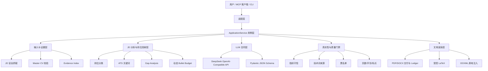
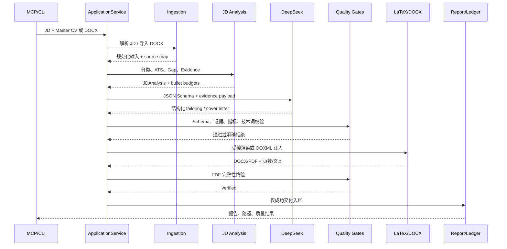

# CareerResumeSkill 系统架构介绍

## 1. 系统定位

CareerResumeSkill 是一个以证据为核心的求职申请包生成系统。它接收职位描述（JD）和候选人的 Master CV 或原始 DOCX 简历，生成针对目标岗位的简历、求职信及 PDF/DOCX 交付物。

系统的核心原则不是让模型自由创作，而是让模型在候选人真实证据范围内完成选择、排序、改写和表达。所有模型输出都必须经过 Schema、证据 ID、技术词、数字指标、版式和 PDF 完整性检查。

系统支持两条主要交付路线：

- **LaTeX Track**：适用于结构化 Master CV 或从零生成单栏简历。
- **DOCX In-situ Track**：适用于必须保留原 Word 模板、字体、表格、图片和既有版式的简历。

## 2. 总体分层



### 2.1 兼容式 Pipeline 基础

当前不实施阶段 1 的 Pipeline 拆分。`ApplicationService` 继续作为唯一用例编排层，MCP、CLI 和未来适配器都通过它共享 JD 分析、Tailoring、渲染、验证和 Ledger 行为。

### 2.1 适配层

适配层不承担业务决策，只负责把外部调用转换成统一的应用服务调用：

- `server.py`：暴露 MCP tools、resources 和 prompts。
- `cli.py`：提供本地一键生成和 `--doctor` 环境诊断。
- `docx_cli.py`：提供 DOCX 检查、注入和转换命令。

MCP 和 CLI 都调用 `ApplicationService`，因此不会产生两套不同的真实性规则。

### 2.2 应用服务层

`application.py` 是主要用例编排层，负责：

1. 读取和校验输入。
2. 解析 JD 并构建岗位分析。
3. 调用 LLM 生成结构化内容。
4. 执行证据、指标、技术词和 Schema 校验。
5. 选择 LaTeX 或 DOCX 文档轨道。
6. 编译、转换、提取 PDF 文本并执行最终门禁。
7. 写入申请报告和成功交付 Ledger。

业务规则集中在服务层和领域模块中，MCP/CLI 不直接拼装简历内容。

## 3. 端到端数据流



输入层还负责网页编码恢复：优先使用 HTTP charset 和 HTML meta charset，再按有限顺序尝试 UTF-8、GB18030、Big5，避免中文 JD 在无响应头声明时乱码。申请账本和 Master CV 历史写入使用原子 lock 文件串行化，DOCX 自动提取的资源目录支持显式清理，避免长期运行产生临时文件堆积。

## 4. 输入与证据模型

### 4.1 Master CV 是唯一事实源

`models.py` 定义 Master CV、JDAnalysis、GeneratedTailoring、TailoredResume 和 CoverLetter 的 Pydantic 合同。候选人的事实只能来自：

- Master CV 的 profile、sections、items、bullets。
- Master CV 的 skills。
- 明确传入并核验过的 `verified_company_context`，仅用于公司特定表述。

JD 只能影响目标岗位、关键词和表达角度，不能成为候选人经历、技术、职责或指标的来源。

### 4.2 Evidence Index

`analysis.py` 和 `facts.py` 为每条来源建立稳定 Evidence ID，例如：

```text
profile
skill:Languages:0
section:1:item:0
section:1:item:0:bullet:2
```

每个生成 bullet 必须引用同一来源 item 下的证据 ID。项目标题、机构、日期和地点由原始 Master CV 回填，不能由模型重新编造。

### 4.3 指标守恒

系统对百分比、延迟、容量、科学计数法、bit 深度等指标进行识别和归一化比较。

指标保护分为三层：

1. **Prompt 层**：向模型传递每个来源 item 的 `REQUIRED_METRICS_BY_SOURCE_ITEM`。
2. **Hydration 层**：如果模型改写遗漏已识别的主要指标，确定性恢复包含该指标的原始证据句。
3. **渲染/终验层**：LaTeX 超页裁剪不会删除包含主要指标的 bullet；PDF 终验仍会检查指标不变性。

模型输出永远不能绕过最终门禁。无法识别的特殊计量写法应先扩展 `facts.py` 的解析规则和测试，再纳入同等级保护。

## 5. JD 分析与动态投射

`analysis.py` 负责确定性分析和预算分配：

- 识别岗位原型，如 `ai_research`、`systems_infra`、`quant_fintech`、`data_engineering` 和 `general_software`。
- 提取 Must-have、Nice-to-have、ATS 原子关键词和业务域。
- 将 JD 要求与 Evidence Index 做证据匹配。
- 生成 `gap_analysis` 和 `evidence_gaps`。
- 按相关度为 source item 分配 Tier 1/2/3 及 bullet 上限。

动态金字塔预算的目标是突出高相关证据，而不是让每段经历拥有相同数量的 bullet：

| 层级 | 典型数量 | 改写强度 | 约束 |
| --- | ---: | --- | --- |
| Tier 1 | 3-4 条 | 完整 lexical projection | 只能使用证据支持的岗位术语 |
| Tier 2 | 2 条 | strategic re-anchoring | 保留核心方法、工具和指标 |
| Tier 3 | 1 条 | polish only | 尽量接近原句，压缩外围细节 |

对于 AI 或 Systems 目标，如果来源项包含已验证的 LLM、SFT、RLHF、DPO、多模态或后训练证据，预算器会提供 Tier 1/Tier 2 最低保底。该规则只改变证据排序优先级，不会把 JD 中未验证的机制变成候选人经历。

## 6. LLM 合同层

`llm.py` 将 DeepSeek 作为 OpenAI-compatible provider，并使用五层约束：

1. 全局系统规则：真实性、数字保真、技术来源、公司声明和排版规则。
2. 任务 Prompt：JD 分析、Resume Tailoring、Cover Letter 的具体结构要求。
3. Pydantic JSON Schema：限制字段、类型、枚举、段落数量和字数。
4. Evidence payload：完整 Master CV、Evidence Index、Fact Cards、JD Analysis 和指标清单。
5. 本地验证：模型返回后继续执行证据和质量检查。

JSON Schema 失败时允许受约束修复；求职信字数边界失败可进行有限的额外修复。修复指令要求模型只修复结构或字数，不得新增事实。后端会计算 `EXACT_SUPPORTED_JD_PHRASES`，只把证据支持的精确 JD 词组传给求职信模型，避免用关键词堆砌替代事实。

未配置 API Key 时，英文流程可以使用明确标记的 deterministic fallback；中文 DOCX 生成要求可用 LLM。系统不会把 fallback 伪装成模型定制结果。

## 7. 两条文档生成轨道

### 7.1 LaTeX Track

适用于结构化 Master CV：

1. 生成 TailoredResume 和 CoverLetter DTO。
2. 将内容注入受控 Jinja LaTeX 模板。
3. 对所有外部文本执行统一 LaTeX 转义。
4. 使用 Tectonic、XeLaTeX 或 LuaLaTeX 编译。
5. 按 0、1、2 三档紧凑级别尝试单页。
6. 仍然超页时，仅按相关度裁剪低优先级内容，并保护主要指标 bullet；Section Heading 保留 `keepNext` 和最小段后间距，避免标题与首个项目在文本抽取层粘连。
7. 对 PDF 执行页数、文本可提取性、技术来源、指标、黑名单、标点和字形检查。

模型永远不直接生成 LaTeX 源码。

### 7.2 DOCX In-situ Track

适用于必须保留原始 Word 模板的场景：

1. `docx_profile.py` 将 DOCX 导入为保守的 Master CV，并建立 paragraph/source map。
2. `docx_engine.py` 分析 OOXML、字体、段落、表格、图片、宽度和样式继承。
3. `calculate_docx_layout_budget` 估算每个原始 bullet 的可用宽度和折行数。
4. 生成内容只允许通过已有 paragraph ID 回填。
5. 注入器复制和保留未修改的 ZIP entry、媒体和样式关系。
6. 先尝试原始版式，再按需使用受限 compact level 1/2。
7. LibreOffice 或 Microsoft Word 转 PDF。
8. 对最终 PDF 执行单页和完整性终验。

DOCX 路线不会把原始简历重建成全新的 LaTeX 模板，也不会通过字符数机械截断 bullet。

## 8. 质量门禁

`quality.py`、`tailoring.py`、`refinement.py` 和 `application.py` 共同构成质量门禁：

- Pydantic Schema 合法。
- Evidence ID 存在且属于对应来源 item。
- 生成技能是 Master CV 的安全子集。
- 生成数字不能超出源证据。
- 主要指标不丢失、不变值、不变单位。
- 技术词必须来自完整 Master CV 或被引用证据。
- 高危黑名单术语必须有明确来源。
- Bullet 不得有尾部破折号、重复句、私有区字形或异常空白。
- PDF 页数必须符合 `page_limit`。
- DOCX/PDF 文本必须可提取且结构顺序可审计。

### 8.1 Deterministic Critic 与 Harness

`critic/` 提供不依赖模型的文本内容审查：Cover Letter 悬垂开头、模板化开场、跨段重复、段落结构，Resume 重复 bullet、Markdown 前缀、异常空白、句末标点，以及 DOCX/PDF 尾部填充检查。Critic 默认输出诊断结果，不擅自改写候选人事实；需要修复时由上层选择受约束的微修复并重新验证。

`docx_sanitizer.py` 提供分层净化：`LexicalSanitizer` 清理不可见字符、前置项目符号和尾部填充，同时保留中英文句末规则；`DocxTreeSanitizer` 清除正文段落 tab，并从样式 tab 中移除 leader 属性，但保留普通对齐 tab，避免破坏机构/地点布局。

`harness/` 读取 `application-report.json` 执行离线断言：优先读取真实 PDF 文本，检查页数、指标保留率、候选人可见文本中的禁用词、Critic 状态、排版尾部破折号、完整性状态和可选 ATS 阈值，并生成 Markdown scorecard。缺少页数或完整性报告会直接失败，避免未编译/未验收产物被误报为通过。Harness 支持通过 JSON cases 文件为多个 Golden Case 配置不同指标、禁用词和页数阈值。ATS 作为可配置阈值，不替代指标、黑名单和证据门禁。

只有最终验证通过的申请包才会写入 `.career_ledger.json`。失败或 dry-run 结果可以用于诊断，但不能伪装成交付成功。

## 9. 公开 API 与适配器

### MCP Tools

`server.py` 提供以下能力：

- JD 与环境：`analyze_job_description`、`check_environment`
- Resume：`tailor_resume_content`、`generate_tailored_payload`
- Cover Letter：`draft_cover_letter`
- LaTeX：`render_and_compile_latex`、`generate_application_package`
- DOCX：`inspect_docx_layout`、`import_docx_master_cv`、`calculate_layout_budget`、`audit_cv_health`、`inject_docx_layout`、`inject_docx_in_situ`、`convert_docx_to_pdf`、`compile_and_verify_pdf`、`generate_docx_application_package`
- 事实维护：`append_experience`

同时提供：

- `cv://master_cv.json`
- `config://archetypes.json`
- `templates://styles.json`
- `workflow_full_tailoring`
- `workflow_quick_audit`

### CLI

```powershell
python -m career_resume_skill.cli --doctor
python -m career_resume_skill.cli --cv examples/master_cv.json --jd-file jd.txt --company "Target" --report output/report.json
python -m career_resume_skill.cli --track docx --docx-template input.docx --output-docx output/tailored.docx --jd-file jd.txt --company "Target" --report output/report.json
```

## 10. 部署与安全

默认部署为本地 MCP stdio，避免未经认证的网络暴露。也支持受控的 streamable HTTP，但应放在认证和反向代理之后。

关键安全措施包括：

- JD 公网 URL 只允许 HTTP(S)，重定向目标重新进行 DNS 和私网地址校验。
- URL 响应限制内容类型、跳转次数和大小。
- API Key 只从根目录 `.env` 或受控环境变量读取，不写入报告、Prompt、源码或日志。
- 输出目录和 DOCX 资源目录应按用户隔离。
- LaTeX、LibreOffice 和 Word 编译应在资源受限环境中运行。
- 多用户部署需要每用户认证、密钥隔离、文件权限隔离和独立 Ledger。

## 11. 可观测交付物

一次完整申请包通常包含：

- Tailored Resume PDF 或 DOCX/PDF。
- Cover Letter PDF、纯文本和 Markdown。
- LaTeX 源码或 DOCX 处理结果。
- `application-report.json`：JD 分析、Gap、证据、ATS、质量报告、修复轨迹和路径。
- `.career_ledger.json`：仅记录已通过终验的申请包。

报告中的 `verified` 是交付级别状态，不代表商业 ATS 认证，也不代表录用概率。ATS 分数只是本地透明关键词覆盖启发式。

## 12. 维护与扩展原则

- 新增岗位原型时，同时更新 Pydantic 枚举、JD 分析规则、Prompt、ATS 词表和测试。
- 新增指标格式时，先更新 `facts.py`、质量门禁和 truthfulness 测试。
- 新增技术词时，更新 `technology_terms.json` 并补充来源/别名测试。
- 修改 DOCX XML 时，优先保持原始包和未修改 entry 不变。
- 任何放宽校验的改动都必须说明证据边界、误报风险和回归测试影响。
- 交付前至少执行 `pytest -q`、Ruff、`--doctor` 和一轮真实 API 包生成。

## 相关文档

- [README.md](../README.md)：安装、配置、MCP 和 CLI 快速开始。
- [architecture.md](architecture.md)：英文实现架构说明。
- [master-cv.md](master-cv.md)：Master CV、Evidence ID 和事实维护规则。
- [docx.md](docx.md)：DOCX 原地回填、布局预算和保真边界。
- [DELIVERABLES.md](../DELIVERABLES.md)：最新交付和验证记录。
